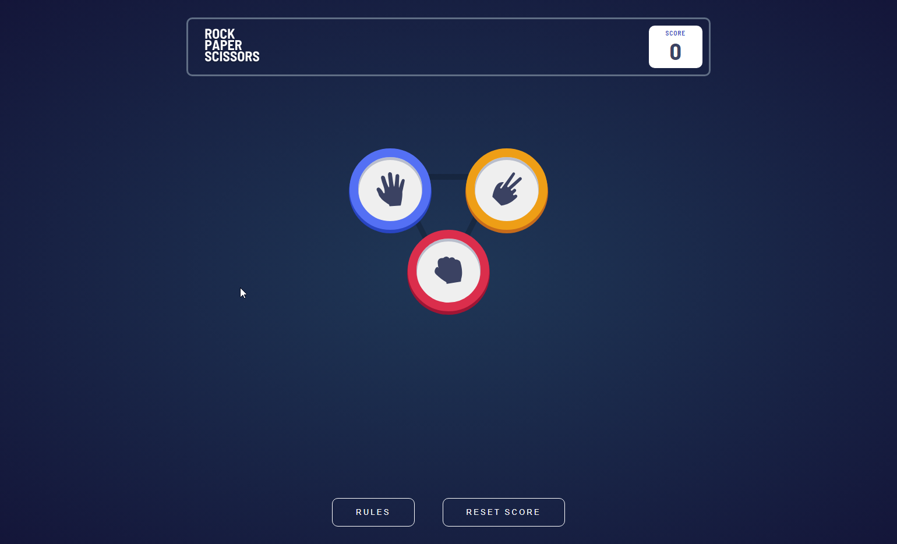

# Rock Paper Scissors App

## Description

Rock Paper Scissors game from Frontend Mentor Community. It's implemented using HTML, SASS, and JavaScript. The game allows a user to play against the computer by choosing one of the three hand shapes: Rock, Paper, or Scissors. After the user makes a choice, the computer also randomly selects one of the hand shapes, and the winner is determined based on the classic Rock Paper Scissors rules.

## Features

- Random Computer Choice: The computer randomly selects one of the hand shapes after the user makes their choice, making the game fair and unpredictable.

- Score Tracking: The game keeps track of the user's score and displays it in the top-right corner of the interface.
- Score Reset: Users can reset their score to zero by clicking the "Reset Score" button in the footer.
- Rules Modal: The game provides a modal overlay that displays the game rules when the "Rules" button in the footer is clicked.
- Responsive Design: The game interface is designed to be responsive and work well on different screen sizes and devices.
- Visual Feedback: When the user makes a choice, the chosen hand shape is highlighted with a border and shadow, providing visual feedback to the user.
- Result Display: After each round, the game displays the result of the round, showing whether the user won, lost, or it was a tie.
- Play Again Option: Users can play again by clicking the "Play Again" button displayed after the round result.
- Local Storage: The user's score is saved to the local storage, allowing the score to persist even if the page is reloaded.

## Technology

  
 
  
  

## Demo

To see a live demo of the Rock Paper Scissors App, visit [Demo](https://www.massidev.com/portfolio/rock-paper-scissors/).

## Installation

To run the Rock Paper Scissors app locally, follow these steps:

1. Clone the repository: `git clone https://github.com/massi-17/rock-paper-scissors-app.git`
2. Navigate to the project directory: `cd rock-paper-scissors-app`
3. Open the `index.html` file in your preferred web browser.

## Contributing

Contributions are welcome! If you want to contribute to this Rock Paper Scissors app, please follow these steps:

1. Fork the repository.
2. Create a new branch: `git checkout -b feature/your-feature`.
3. Make your changes and commit them: `git commit -m 'Add your feature'`.
4. Push to the branch: `git push origin feature/your-feature`.
5. Submit a pull request.
